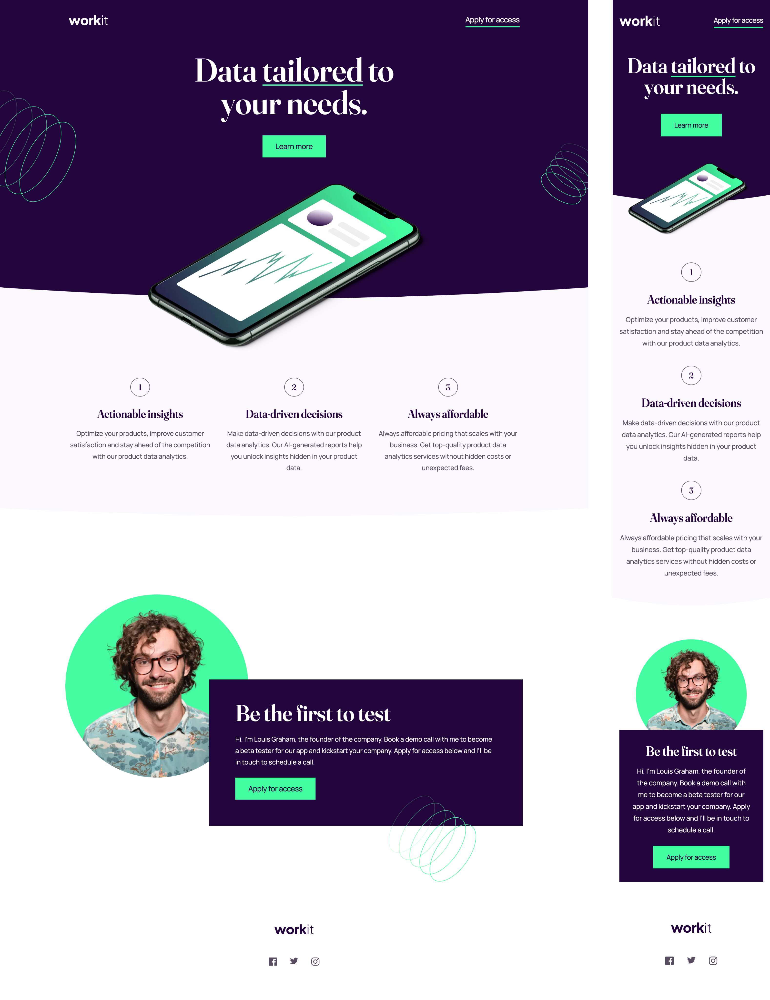

# Frontend Mentor - Workit landing page solution

This is a solution to the [Workit landing page challenge on Frontend Mentor](https://www.frontendmentor.io/challenges/workit-landing-page-2fYnyle5lu). Frontend Mentor challenges help you improve your coding skills by building realistic projects.

## Table of contents

- [Overview](#overview)
  - [The challenge](#the-challenge)
  - [Screenshot](#screenshot)
  - [Links](#links)
- [My process](#my-process)
  - [Built with](#built-with)
  - [What I learned](#what-i-learned)
  - [Useful resources](#useful-resources)
- [Author](#author)

## Overview

### The challenge

Users should be able to:

- View the optimal layout for the interface depending on their device's screen size
- See hover and focus states for all interactive elements on the page

### Screenshot

### Links

- Live Site URL: [Workit landing page](https://kwiatkowskimaciej.github.io/workit-landing-page/)

## My process

### Built with

- Semantic HTML5 markup
- CSS custom properties
- Flexbox
- Mobile-first workflow

### What I learned

- What is and how to use **clamp** function
- How to add fonts from file to CSS

### Useful resources

- [Clamp() function calculator](https://www.marcbacon.com/tools/clamp-calculator/) - This helped me with finding preferred value inside clamp function.
- [Fluid Typography](https://css-tricks.com/snippets/css/fluid-typography/) - This is an amazing article which helped me finally understand clamp function. And it also helped me make text on this site responsive.

## Author

- Frontend Mentor - [@kwiatkowskimaciej](hhttps://www.frontendmentor.io/profile/kwiatkowskimaciej)
